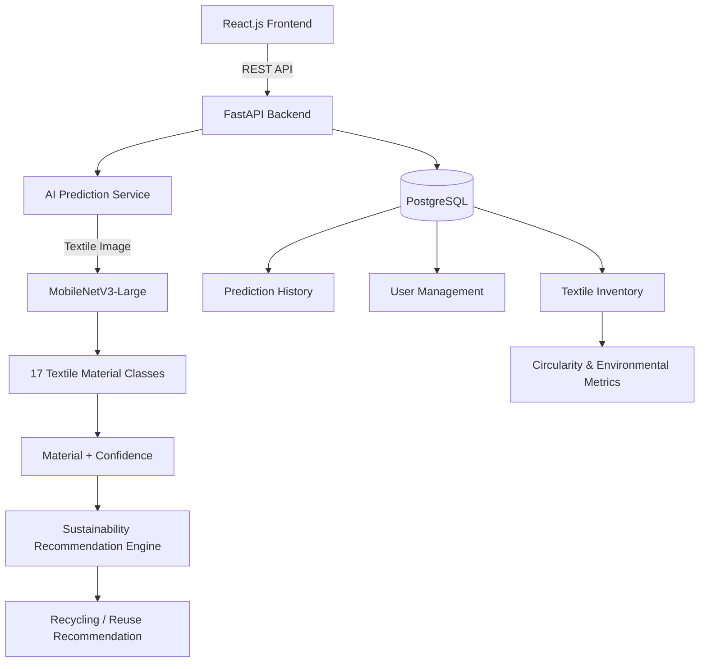

# Textile Waste Intelligence Platform

The **Textile Waste Intelligence Platform** is an AI-powered web application designed to support textile waste classification, inventory management, sustainability analysis, and circular-economy workflows.

The system accepts a **textile/fabric image** and uses a custom **MobileNetV3-Large PyTorch model** to identify the textile material and provide a prediction confidence score.

The predicted material is then used by the sustainability layer to provide recycling, reuse, and lifecycle recommendations.

---

## Project Objective

The platform aims to assist in intelligent textile waste management by combining:

- AI-based textile material classification
- Prediction confidence analysis
- Sustainability and recycling recommendations
- Textile waste inventory management
- Prediction history and logging
- Circularity and environmental-impact metrics
- Role-based access control
- React-based dashboard
- FastAPI REST backend
- PostgreSQL database

---

# System Architecture



---

# Main Workflow

```text
Textile / Fabric Image
          ↓
     Image Upload
          ↓
      FastAPI API
          ↓
 Image Preprocessing
          ↓
 MobileNetV3-Large
          ↓
 Material Classification
          ↓
 Material + Confidence
          ↓
 Sustainability Engine
          ↓
 Recycling / Reuse Recommendation
          ↓
 PostgreSQL
          ↓
 React Dashboard
```

---

# Features

## 1. AI Textile Material Classification

The platform uses a custom-trained **MobileNetV3-Large** deep-learning model to classify textile/fabric images.

The model contains **17 material classes**.

### Supported Materials

```text
Acrylic
Chenille
Corduroy
Cotton
Crepe
Denim
Felt
Fleece
Linen
Nylon
Polyester
Satin
Silk
Terrycloth
Velvet
Viscose
Wool
```

---

# 2. Image Prediction

The user uploads a textile or fabric image through the application.

The AI model performs:

```text
Image
  ↓
Resize to 224 × 224
  ↓
Tensor Conversion
  ↓
ImageNet Normalization
  ↓
MobileNetV3-Large
  ↓
Softmax Probabilities
  ↓
Predicted Material
  ↓
Confidence Score
```

Example:

```text
==================================================
TEXTILE PREDICTION
==================================================

Predicted Material : Cotton
Confidence         : 87.43%
```

---

# 3. Sustainability Recommendation

The material prediction is passed to a separate sustainability/recommendation layer.

Example:

```text
Material:
Cotton

Confidence:
87.43%

Sustainability:
Recommended for further recycling/reuse analysis.
```

The sustainability module is separated from the image-classification model so that recommendation rules can be modified independently.

> The current MobileNetV3-Large model performs **17-class material classification**. It does not directly classify images as recyclable or non-recyclable.

---

# 4. Textile Waste Inventory

The platform provides inventory management for textile waste.

Users can manage:

- Textile waste records
- Material information
- Waste quantities
- Inventory status
- Lifecycle information
- AI prediction information
- Sustainability recommendations

Inventory operations include:

- Create
- Read
- Update
- Delete

---

# 5. Prediction History

AI predictions can be stored in PostgreSQL for future analysis and reporting.

Prediction records can contain:

```text
Prediction ID
Material
Confidence
Image information
Timestamp
User
Status
```

This provides historical tracking of AI classification results.

---

# 6. Dashboard

The React dashboard provides visualization of textile waste and sustainability information.

The dashboard can display:

- Textile material distribution
- Inventory statistics
- AI prediction statistics
- Prediction history
- Sustainability recommendations
- Circularity KPIs
- Environmental-impact metrics

---

# Machine Learning

## Model Used

The final model used in this project is:

```text
MobileNetV3-Large
```

The model was selected because it provides a good balance between:

- Classification performance
- Computational efficiency
- Model size
- Inference speed
- Deployment suitability

---

# Dataset Preparation

The training data was created by combining suitable textile/fabric image sources and cleaning the material categories.

The final clean material dataset contains:

```text
Total Images: 5624
Total Classes: 17
```

---

# Dataset Classes

| Class | Images |
|---|---:|
| Acrylic | 48 |
| Chenille | 52 |
| Corduroy | 96 |
| Cotton | 2352 |
| Crepe | 104 |
| Denim | 648 |
| Felt | 16 |
| Fleece | 132 |
| Linen | 76 |
| Nylon | 228 |
| Polyester | 904 |
| Satin | 96 |
| Silk | 200 |
| Terrycloth | 120 |
| Velvet | 44 |
| Viscose | 148 |
| Wool | 360 |
| **Total** | **5624** |

---

# Dataset Split

The dataset was divided into training, validation, and testing subsets.

```text
Training     : 3929 images
Validation   : 837 images
Testing      : 858 images
Total        : 5624 images
```

### Split Ratio

```text
70% Training
15% Validation
15% Testing
```

### Training Distribution

```text
Acrylic       -> 33
Chenille      -> 36
Corduroy      -> 67
Cotton        -> 1646
Crepe         -> 72
Denim         -> 453
Felt          -> 11
Fleece        -> 92
Linen         -> 53
Nylon         -> 159
Polyester     -> 632
Satin         -> 67
Silk          -> 140
Terrycloth    -> 84
Velvet        -> 30
Viscose       -> 103
Wool          -> 251
```

---

# Handling Class Imbalance

The original dataset contained significant class imbalance.

For example:

```text
Cotton       -> 1646 training images
Felt         -> 11 training images
Acrylic      -> 33 training images
Polyester    -> 632 training images
```

To reduce the effect of class imbalance, a **class-balanced training sampler** was implemented.

The balanced sampler gives underrepresented classes greater sampling importance during training.

This allows the model to learn minority classes more effectively.

---

# Data Augmentation

Training images use augmentation techniques including:

```text
Resize
Random Horizontal Flip
Random Vertical Flip
Random Rotation
Color Jitter
```

Validation and test images use only deterministic preprocessing:

```text
Resize
ToTensor
Normalization
```

The input image size is:

```text
224 × 224 × 3
```

---

# Training Configuration

```text
Model:
MobileNetV3-Large

Training:
From Scratch

Number of Classes:
17

Input Size:
224 × 224

Batch Size:
32

Optimizer:
AdamW

Learning Rate:
0.001

Weight Decay:
0.0001

Epochs:
30

Learning Rate Scheduler:
CosineAnnealingLR

Training Strategy:
Class-Balanced Sampling

Device:
CUDA GPU
```

---

# Model Architecture

The final classifier of MobileNetV3-Large was modified for the 17 textile material classes.

```text
Sequential(
    Linear(960 → 1280)
    Hardswish()
    Dropout(p=0.2)
    Linear(1280 → 17)
)
```

Therefore, the final network produces:

```text
17 output probabilities
```

one for each textile material class.

---

# Model Performance

The final balanced MobileNetV3-Large model achieved:

| Metric | Result |
|---|---:|
| Validation Accuracy | **79.09%** |
| Test Accuracy | **77.97%** |
| Test Images | **858** |
| Number of Classes | **17** |

The best model was obtained at:

```text
Best Epoch:
30

Best Validation Accuracy:
79.09%
```

---

# Classification Evaluation

The model was evaluated using:

- Accuracy
- Precision
- Recall
- F1-score
- Classification report
- Confusion matrix
- Real-image inference testing

The final test accuracy was:

```text
77.97%
```

---

# Best Trained Model

The best trained checkpoint is:

```text
best_mobilenetv3_balanced.pth
```

Expected model location during training:

```text
/content/textile_project/checkpoints/best_mobilenetv3_balanced.pth
```

For the VS Code application, the model should be placed inside the backend AI model directory.

Example:

```text
backend/
└── ml/
    └── model/
        ├── best_mobilenetv3_balanced.pth
        └── class_mapping.json
```

---

# Class Mapping

The model uses the following fixed class-to-index mapping:

```python
classes = [
    "Acrylic",
    "Chenille",
    "Corduroy",
    "Cotton",
    "Crepe",
    "Denim",
    "Felt",
    "Fleece",
    "Linen",
    "Nylon",
    "Polyester",
    "Satin",
    "Silk",
    "Terrycloth",
    "Velvet",
    "Viscose",
    "Wool"
]
```

The class mapping must remain unchanged when loading the trained model in the backend.

---

# Technology Stack

## Frontend

```text
React.js
Vite
Tailwind CSS
JavaScript
REST API
```

## Backend

```text
Python
FastAPI
Uvicorn
SQLAlchemy
```

## Machine Learning

```text
PyTorch
Torchvision
MobileNetV3-Large
NumPy
Scikit-learn
Pillow
```

## Database

```text
PostgreSQL
```

## Development

```text
Visual Studio Code
Google Colab
Git
GitHub
Kaggle API
```

---

# Backend API

The FastAPI backend provides REST APIs for image upload, AI prediction, inventory management, authentication, and prediction history.

## Upload Textile Image

```http
POST /upload
```

Uploads a textile image to the backend.

---

## Predict Textile Material

```http
POST /predict
```

The endpoint receives an uploaded image/file reference and performs AI classification.

Example response:

```json
{
    "material": "Cotton",
    "confidence": 0.8743
}
```

The endpoint can also return sustainability information:

```json
{
    "material": "Cotton",
    "confidence": 0.8743,
    "sustainability": {
        "recommendation": "Suitable for recycling/reuse analysis"
    }
}
```

---

# API Documentation

When the backend is running, FastAPI provides interactive API documentation.

### Swagger UI

```text
http://localhost:8000/docs
```

### ReDoc

```text
http://localhost:8000/redoc
```

---

# Backend Installation

Navigate to the backend directory:

```bash
cd backend
```

Create a Python virtual environment:

```bash
python -m venv venv
```

### Windows

```bash
.\venv\Scripts\Activate
```

### macOS/Linux

```bash
source venv/bin/activate
```

Install dependencies:

```bash
pip install -r requirements.txt
```

Run the FastAPI server:

```bash
uvicorn app.main:app --reload --port 8000
```

Backend:

```text
http://localhost:8000
```

Swagger:

```text
http://localhost:8000/docs
```

---

# Frontend Installation

Open a new terminal:

```bash
cd frontend
```

Install dependencies:

```bash
npm install
```

Run the React development server:

```bash
npm run dev
```

Frontend:

```text
http://localhost:5173
```

---

# Complete AI Prediction Flow

```text
┌──────────────────────────┐
│      User Uploads        │
│     Textile Image        │
└────────────┬─────────────┘
             │
             ▼
┌──────────────────────────┐
│      React Frontend      │
└────────────┬─────────────┘
             │
             │ REST API
             ▼
┌──────────────────────────┐
│      FastAPI Backend     │
└────────────┬─────────────┘
             │
             ▼
┌──────────────────────────┐
│    Image Preprocessing   │
│      224 × 224 RGB       │
└────────────┬─────────────┘
             │
             ▼
┌──────────────────────────┐
│   MobileNetV3-Large      │
│       17 Classes         │
└────────────┬─────────────┘
             │
             ▼
┌──────────────────────────┐
│ Material + Confidence    │
└────────────┬─────────────┘
             │
             ▼
┌──────────────────────────┐
│ Sustainability Engine    │
└────────────┬─────────────┘
             │
             ▼
┌──────────────────────────┐
│ Recycling / Reuse        │
│ Recommendation           │
└────────────┬─────────────┘
             │
             ▼
┌──────────────────────────┐
│       PostgreSQL         │
│ Prediction History       │
│ Inventory                │
└──────────────────────────┘
```

---

# Project Directory Structure

```text
Textile-Waste-Intelligence-Platform/
│
├── backend/
│   │
│   ├── app/
│   │   ├── main.py
│   │   ├── routes/
│   │   ├── models/
│   │   ├── schemas/
│   │   └── services/
│   │
│   ├── ml/
│   │   ├── train.py
│   │   ├── predict.py
│   │   └── model/
│   │       ├── best_mobilenetv3_balanced.pth
│   │       └── class_mapping.json
│   │
│   ├── uploads/
│   ├── reports/
│   ├── logs/
│   ├── tests/
│   └── requirements.txt
│
├── frontend/
│   │
│   ├── src/
│   │   ├── components/
│   │   ├── pages/
│   │   ├── services/
│   │   └── routes/
│   │
│   ├── index.html
│   └── package.json
│
├── README.md
└── .gitignore
```

---

# Example User Experience

### Step 1 — Upload

```text
User selects textile image
```

### Step 2 — AI Prediction

```text
Predicted Material:
Cotton

Confidence:
87.43%
```

### Step 3 — Sustainability Analysis

```text
Material:
Cotton

Sustainability Recommendation:
Proceed with recycling/reuse assessment.
```

### Step 4 — History

The prediction is stored in the database for future tracking and reporting.

---

# Security and Access Control

The platform supports role-based access control.

Authentication and authorization are handled through the backend.

Protected functionality includes:

- User management
- Textile inventory
- Prediction history
- Administrative operations
- Reports
- Dashboard data

---

# Testing

The project includes testing for:

## Machine Learning

- Dataset verification
- Batch verification
- Model output verification
- Validation accuracy
- Test accuracy
- Classification report
- Confusion matrix
- Real-world image inference

## Backend

- API endpoint testing
- Image upload testing
- Prediction testing
- Authentication testing
- Inventory CRUD testing
- Database testing

## Frontend

- Image upload
- Image preview
- Prediction display
- Confidence display
- API error handling
- Loading states
- Dashboard functionality

---

# Current Project Status

```text
DATASET
✅ Dataset collection
✅ Dataset cleaning
✅ 17 material classes
✅ 5624 images
✅ Train / validation / test split

MACHINE LEARNING
✅ MobileNetV3-Large
✅ Training from scratch
✅ Data augmentation
✅ Class-balanced sampling
✅ AdamW optimizer
✅ CosineAnnealingLR
✅ 30 epochs
✅ Model checkpoint
✅ Classification report
✅ Confusion matrix
✅ 79.09% validation accuracy
✅ 77.97% test accuracy

BACKEND
⬜ Model integration
⬜ Prediction service
⬜ /predict endpoint verification
⬜ Database prediction logging
⬜ Sustainability integration

FRONTEND
⬜ AI image upload
⬜ Prediction result UI
⬜ Confidence display
⬜ Sustainability result UI

SYSTEM
⬜ End-to-end integration
⬜ Real-world image testing
⬜ Final system testing
⬜ Deployment
```

---

# Future Enhancements

Future improvements may include:

- Increasing the number of textile material classes
- Improving real-world image classification
- Increasing minority-class samples
- Improving blended-fabric classification
- Dedicated recyclability classification using a properly labeled recyclability dataset
- Advanced sustainability scoring
- Automated recycling recommendations
- Textile lifecycle prediction
- Environmental-impact estimation
- Model monitoring
- Production deployment

---

# Developers

- **Sanju B** — Lead Developer

---

# License

This project is developed as an academic/major project for research and educational purposes.
