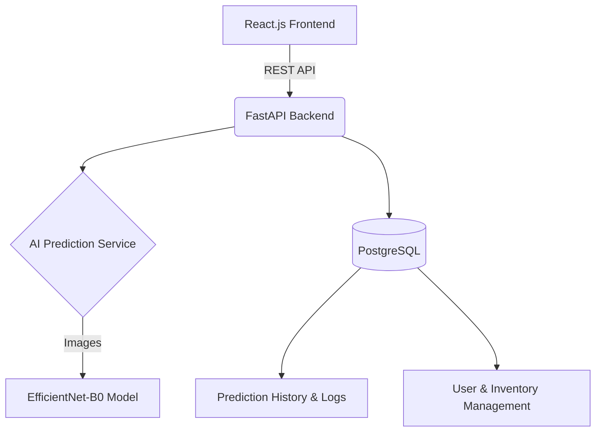

# Textile Waste Intelligence Platform

The Textile Waste Intelligence Platform is an AI-powered system driving circular economy initiatives by automating the classification, sorting, and lifecycle tracking of post-consumer textile waste.

## Project Architecture



## Features
- **AI Classification**: Real-time identification of textile compositions using a custom PyTorch model (`product_classifier.pth`) based on the EfficientNet-B0 architecture.
- **Sustainability Metrics**: Automatically scores recyclability and proposes actionable recommendations.
- **Inventory Management**: Track and manage waste logs across their lifecycle.
- **Rich Dashboard**: Visualization of circularity KPIs, product distributions, and environmental impact.
- **Database Integration**: Comprehensive tracking of predictions natively stored in PostgreSQL (`PredictionHistory`), including IP addresses and status logging for ESG reporting.

## Installation Guide

### 1. Backend Setup (FastAPI & PyTorch)

Navigate to the backend directory and set up your virtual environment:

```bash
cd backend
python -m venv venv
# On Windows:
.\venv\Scripts\Activate
# On Mac/Linux:
source venv/bin/activate
```

Install requirements and run the server:
```bash
pip install -r requirements.txt
uvicorn app.main:app --reload --port 8000
```

*(Note: The `ml` folder contains `train.py` for training the model using the provided Kaggle dataset.)*

### 2. Frontend Setup (React & Vite)

Open a new terminal and navigate to the frontend directory:

```bash
cd frontend
npm install
npm run dev
```

The frontend will start on `http://localhost:5173`.

## API Documentation

The backend provides a RESTful API powered by FastAPI. When the server is running, you can access the automatically generated interactive documentation:
- **Swagger UI**: `http://localhost:8000/docs`
- **ReDoc**: `http://localhost:8000/redoc`

### Core Endpoints:
- `POST /upload`: Upload a textile image to the `uploads/` directory.
- `POST /predict`: Submit a filename for AI classification. Returns prediction, confidence, sustainability score, and recommendations. All predictions are automatically logged to the PostgreSQL database for history tracking.

## Directory Structure

```text
├── backend/
│   ├── app/           # FastAPI application (routes, models, services)
│   ├── ml/            # Machine learning pipeline (training, datasets)
│   ├── uploads/       # Storage for uploaded images
│   ├── reports/       # Generated PDF/CSV reports
│   ├── logs/          # System logs
│   ├── tests/         # Unit and integration tests
│   └── requirements.txt
├── frontend/
│   ├── src/           # React application (components, pages, routes)
│   ├── index.html
│   └── package.json
└── README.md
```

## Developers
- **Sanju B** (Lead Developer)
